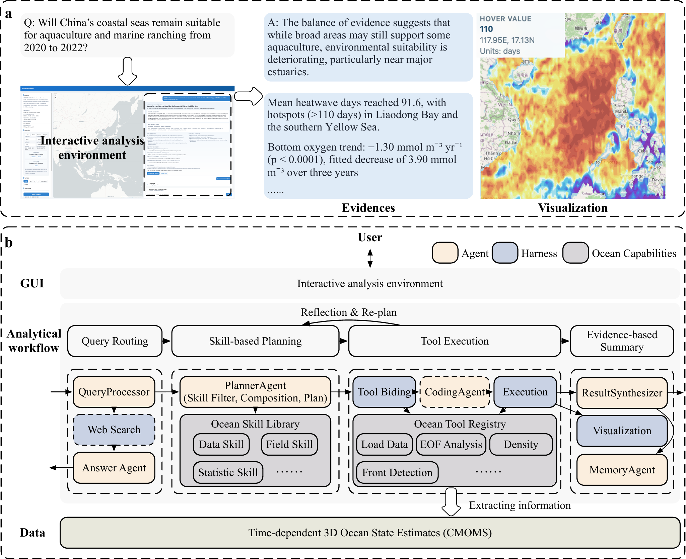

# OceanMind: A LangGraph AI system for ocean diagnosis

<p align="center">Ask ocean questions in natural language and get planned, traceable analyses of time-dependent 3D ocean data.</p>

<p align="center">
  <a href="http://143.89.31.83"></a>
</p>

**Contents**

- [OceanMind: A LangGraph AI system for ocean diagnosis](#oceanmind-a-langgraph-ai-system-for-ocean-diagnosis)
  - [Architecture](#architecture)
  - [Quick Start](#quick-start)
    - [Step 1: Install dependencies](#step-1-install-dependencies)
    - [Step 2: Configure environment](#step-2-configure-environment)
    - [Step 3: Start](#step-3-start)
  - [Use CMEMS for Global Ocean Diagnosis](#use-cmems-for-global-ocean-diagnosis)
  - [Example Queries](#example-queries)
  - [Benchmarks](#benchmarks)
  - [Citation and License](#citation-and-license)
  - [Development](#development)

## Architecture

OceanMind is a natural-language workspace for analyzing time-dependent,
three-dimensional ocean data. A LangGraph agent can answer directly, search
the web, read skills for method guidance, and write Python that calls ocean
analysis tools. The interactive map/chat interface displays intermediate
results, maps, time series, statistics, and evidence-based interpretations.

- Natural-language analysis over Zarr and NetCDF datasets.
- Reusable tools and optional skill guidance for spatial, temporal, vertical,
  event, and diagnostic analysis, including questions without a matching skill.
- Transparent plans, intermediate results, and interactive visualizations.
- A Next.js frontend backed by FastAPI and ocean-domain Python tools.

[](assets/oceanmind-architecture.pdf)

## Quick Start

### Step 1: Install dependencies

Python 3.10 and Node.js 20 are recommended:

```bash
conda create -n ocean python=3.10 nodejs=20 -y
conda activate ocean
conda install -c conda-forge cartopy netcdf4 dask zarr numcodecs gsw -y
python -m pip install -U pip
python -m pip install -e ".[zarr]"
```

### Step 2: Configure environment

Copy the example configuration and set your API credentials in `.env`:

```bash
cp .env.example .env
```

```env
OPENAI_API_KEY="your_api_key"
OPENAI_BASE_URL="https://api.deepseek.com"
OPENAI_MODEL="deepseek-flash"
```

Set `data_path` in `configs/dataset_config.yaml` to the directory containing
your ocean dataset and update its metadata for that dataset. Set
`CARTO_BASEMAP_API_KEY` in `.env` for the interactive map. The agent and
API-backed web search use `OPENAI_MODEL` by default; `AGENT_MODEL` and
`WEB_SEARCH_MODEL` are optional overrides.

### Step 3: Start

Linux and macOS:

```bash
bash start-server.sh
```

Windows:

```powershell
.\start-server.bat
```

On Windows, analysis runs directly under your Windows user account by default;
Docker and WSL are not required. This allows the analysis worker to read the
same SMB/UNC dataset that the normal viewer can read. Model-generated Python
has your account's file and network access, so use this mode only for a trusted
deployment. To opt into AppContainer isolation for data on local NTFS volumes,
set `OCEANMIND_WINDOWS_ANALYSIS_MODE=appcontainer` in `.env` and restart the
server. This AppContainer implementation cannot authorize a network-share dataset. Its
native acceptance check is `python -m pytest tests/test_e_windows_sandbox.py`
after installing the optional dev dependencies.

The launcher installs frontend dependencies and rebuilds the frontend when its
source changes, then starts both services. Open
[http://localhost:3000](http://localhost:3000).

To stop the launcher from another terminal, run `bash start-server.sh stop`
(or `start-server.bat stop` on Windows). The default frontend host is
`127.0.0.1`; use `--web-host 0.0.0.0` only when direct network access is intended.

## Use CMEMS for Global Ocean Diagnosis

Convert downloaded CMEMS NetCDF files to OceanMind's per-variable Zarr stores:

```bash
python data/convert_cmems_to_oceanmind.py /path/to/cmems_nc /path/to/cmems_zarr
```

Point `configs/dataset_config.yaml` at the converted data:

```yaml
name: CMEMS
data_path: /path/to/cmems_zarr
backend: zarr
zarr_store_pattern: "CMEMS_{variable}.zarr"
```

Update the dataset metadata, then restart OceanMind:

```bash
python data/backfill_dataset_depths.py configs/dataset_config.yaml
```

## Example Queries

```text
Show the mean sea-surface temperature over the South China Sea from 2014 to 2022.

Plot January 2018 bottom salinity over 113E-124E and 13.5N-24.5N.

Find areas where bottom oxygen was below 60 mmol/m3 during summer 2020.

Compute the normal volume transport across a transect from 116E,18N to 121E,22N.
```

Adjust the region and dates to match your active dataset.

## Benchmarks

The benchmark record and evaluation protocol are available at
[https://doi.org/10.5281/zenodo.21189249](https://doi.org/10.5281/zenodo.21189249).

## Citation and License

If you use OceanMind in research or demonstrations, cite the OceanMind
manuscript and the underlying ocean datasets. A formal citation will be added
when available.

This repository does not currently include a license.

## Development

Please feel free to contact Fan Zhang ([mafzhang@ust.hk](mailto:mafzhang@ust.hk)),
Prof. Can Yang ([macyang@ust.hk](mailto:macyang@ust.hk)), or Prof. Jianping Gan
([magan@ust.hk](mailto:magan@ust.hk)) if any inquiries.
