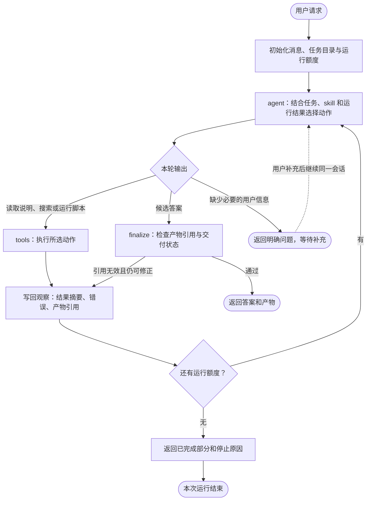
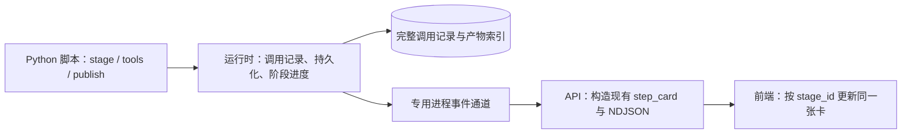

# OceanMind 后端重建目标与执行约定

## 目标

在 `langgraph` 分支逐步重建 OceanMind 后端。保留现有前端、海洋分析工具和项目 skills；最终移除旧的多 agent 编排与固定 skill 匹配流程。新后端只用 **LangGraph** 编排一个 agent 循环。

完成后应具备以下行为：

1. 普通知识问题：直接回答；需要时调用 `web_search`。
2. 数据分析：LLM 按需阅读 skill 和工具说明，生成普通 Python 脚本调用现有工具；缺少的计算直接在脚本中补充。执行后可以修正、读图或回答。
3. 执行过程：前端按“读取数据、检测涡旋、绘图”等分析阶段展示进度；后台逐次保存工具调用及中间结果。循环内的一百次检测更新同一个阶段，不产生一百张步骤卡。

目标接入 DeepSeek V4.1 Flash，计划使用模型名 `deepseek-flash`；接入时验证服务实际支持的模型标识、工具调用与图像输入。当分析产生图像且图像内容关系到答案时，让模型读取图像，描述空间分布、梯度、热点等可见形态；再结合数值结果回答。图像观察不能单独证明统计显著性或物理机制。

## 重构前代码复核依据（历史记录）

下表记录最初制定计划时对三份 skill 及旧执行链的静态阅读；后续 C 已运行真实工具样例并修改涡旋工具，D 已改写这三份 skill。

| skill | 现有调用链与实际行为 | 对重构的影响 |
| --- | --- | --- |
| `skills/ocean_eddy_detection/SKILL.md` | 加载 `u`、加载 `v`、`detect_eddies`。`domain/ocean/events/eddy/detect.py` 接收两个 xarray 场，用 Okubo–Weiss 阈值与面积/半径筛选事件，返回 `events`、`statistics`、`mask`、OW/涡度场及坐标。 | 这是具体检测任务的做法说明。应保留必要输入、算法选择、默认参数和依赖顺序；任务完成标准是得到正确范围的检测结果，通常无需机制证据分级。 |
| `skills/ocean_environment_health_assessment/SKILL.md` | 组合温度趋势、藻华、底层氧、层结等诊断；如底层氧分支调用 `load_dataset → compute_area_weighted_mean → compute_trend`，另有 `detect_hypoxia` 及事件统计/空间汇总。 | 属于需要按问题选择分析分支的综合任务。应指导选哪些指标、怎样理解局限，而非默认执行所有分支。 |
| `skills/ocean_policy_recommendation/SKILL.md` | 调用 `domain/ocean/interpretation/explain.py` 的 `assemble_policy_recommendation_report`。该函数读取带 `output_type` 的诊断结果，用已有规则产生建议；空输入会产生通用的“先补充证据”建议。 | 政策建议需要有依据地解释已完成分析。旧报告函数是可选的规则工具，其生成的建议不能当成新计算或新证据。 |

现有 skill 中的 Python 块是 DSL。`packages/harness/manual_loader.py` 把 `u_field.data` 转成 `$ref:u_field.data`；planner 编译为步骤后，`packages/harness/executor.py` 依次调用 `ToolOrchestrator.execute_tool`。`packages/tool_loader/orchestrator.py` 负责解析引用、调用 Python 函数、缓存真实对象并包装结果。新接口可复用其中的结果标准化、摘要和进度能力；不需要保留 `$ref` 解析和旧计划执行流程。

具体差异要保留在迁移验收中：

- `load_dataset` 原始返回 `DataArray` 或分区数据对象。执行层才将其包装为 `data_container_result`，其中 `.data` 引用指向整个数据对象。在普通 Python 脚本里直接调用 `load_dataset` 后，应把返回对象传给 `detect_eddies`；不能照抄 DSL 的 `u_field.data`，否则可能只传入底层数组并丢失坐标。
- 重构前的 `detect_eddies` 只取输入的第一个时间步和第一个 `depth`/`z` 层；C8 已改成要求显式二维水平场。返回的 `mask` 是阈值掩膜，`events` 才经过像素数与半径筛选，两者不能混称。该工具本身不生成图片。
- 环保 skill 的正文将固定报告工具标为 explicit-only，Stage 6 却直接调用报告工具；Stage 6 的 `branches=[sst_trend, ...]` 也与 `assemble_environment_health_report` 逐项读取 `{name, result, worse_when, ...}` 的结构不一致。按模板直接调用会缺少 `result`。需在改写该 skill 时修正，不依赖模型临时猜测修补。
- 旧代码路径已支持 `run(inputs, params) -> dict`，但 `packages/harness/code_runner.py` 限制导入且不支持当前设想的完整脚本读写与 matplotlib 绘图。新的完整分析脚本能力需要明确构建，不能把旧代码节点视为已经满足目标。
- 当前前端的涡旋圆形覆盖物由 `apps/api/main.py` 从事件中心和半径转换得到；`render_contourf_image` 生成的是无坐标轴的地图图层。LLM 看空间图需要单独生成带范围、图例/色标信息的可解释图片。
- `packages/tool_loader/progress.py` 已有工具进度回调。`apps/web/components/ocean-workspace-app.tsx` 按 `step_id` 合并步骤卡；`apps/web/lib/types.ts` 的 `StepProgress` 已支持 `completed_units`、`total_units`、`current_unit` 和可选的 `percent`。新后端应让分析阶段对应 `step_id`，同一阶段持续更新同一张卡。
- 现有事件处理需要完整的 `step_card`；只发送事件名称和百分比不足以兼容页面。现有结果卡与地图投影可以复用，但尚未确认其支持大批结果的分页浏览；完整保存结果和把全部结果推到浏览器是两个独立问题。

## 核心设计

### 1. 真正执行的 loop

**数据分析统一采用“LLM 写普通 Python → 执行脚本 → 将运行结果返回同一个 LLM”的循环。** skill 统一作为可读说明；LLM 可以使用 Python 的循环、条件、函数和科学计算库来组织任务。脚本中的 `tools.*` 自动记录调用和结果，`stage(...)` 指定前端展示的分析阶段。它们都是普通 Python 接口。



代码中的核心节点是 `agent`、`tools` 和 `finalize`。图中的初始化、结果记录和额度检查是普通运行时代码。`agent` 是唯一做任务决策的 LLM 节点；`finalize` 做程序可检查的工作，不另设评审 agent。

普通问题可以第一轮就给出候选答案。需要搜索、数据分析、代码或图片的问题，按需要经过任意多轮 `agent → tools → agent`。数据分析都走同一个脚本运行入口，不按 skill 类型、已知/未知任务设置路由。

loop 的一次动作可以是“执行完整涡旋检测脚本”，脚本内部加载 u、v，再对指定时间/深度循环调用检测函数。运行时前端显示“读取数据”和“涡旋检测 36/100”等阶段进度；脚本完成、报错或被终止后，LLM 再根据结果继续。进度回调不经过 LLM，也不要求每个工具执行后都调用一次 LLM。

阶段只是脚本运行时的展示分组，不是 LangGraph 节点或 skill 路由。系统不会读取 `stage` 块并把它重新编译为工作流；真实执行顺序由 Python 决定，后续动作由同一个 agent 根据运行观察决定。

这一基础循环采用 LangGraph 官方示例中的模型节点、工具节点和条件边结构；OceanMind 的数据、skill、代码和图像能力都接在循环内。[LangGraph 官方 quickstart](https://docs.langchain.com/oss/python/langgraph/quickstart)

### 2. 每一轮具体发生什么

1. **读取上下文。** agent 收到用户目标、已知的数据入口、可用能力说明、skill 索引，以及此前各轮的观察结果。初始上下文无需加载整库 skill 或数据数组。
2. **决定下一项动作。** agent 判断哪些工作尚未完成：读取方法说明、确认输入、执行计算、查看结果，或组织解释。计算路径已知时可以直接按方法实施；环保/机制问题可能需要依据已有诊断再选分析分支。
3. **执行。** `run_analysis` 执行保存的代码；工具包装负责参数校验、调用记录和结果登记，阶段上下文负责前端进度。需要模型查看结果才能决定的动作分轮进行；已知依赖顺序和时间/深度遍历直接由 Python 执行。
4. **形成观察。** 将执行状态、简短结果、产物引用或错误写回状态。工具报错也返回 agent，供它修改参数、换方法或停止。
5. **重新判断。** agent 检查任务是否完成：涡旋检测检查日期、范围、参数和事件输出；环保评估还需检查指标覆盖与结论支持程度。仅在报错、结果异常或任务未完成时继续，不要求每个计算任务额外构造证据报告。

每次任务最多作 60 次模型决策；脚本内的细粒度工具调用不消耗这一额度。任务没有统一 120 秒截止时间，单次脚本运行仍有独立资源限制。错误作为观察返回 agent，由它选择修正方法或交付已有结论；触及额度时也交付最新草稿和已保存产物。

### 3. agent 能选择哪些动作

以下名称描述能力边界，实现时保持简单，每次只接入一个能力。

| 动作 | 用途 | 返回给下一轮 agent 的内容 |
| --- | --- | --- |
| `web_search` | 查询外部资料与方法 | 摘要、来源链接 |
| `read_skill` | 读取计算做法或综合分析指导；可继续读其引用的 skill | skill 原文；不编译为强制执行 DSL |
| `inspect_data` | 查看实际文件、变量、维度、坐标、单位、覆盖范围和小样本 | 元数据与可访问的数据引用 |
| `find_tools` | 基于现有 `introspect.py` 与 `registry.py` 查看参数和输入输出约定 | 工具说明；无合适工具也是正常结果 |
| `write_analysis` | 新建或修订完整 Python 分析文件，可以组合现有函数和新增计算 | 代码版本与路径 |
| `run_analysis` | 执行指定版本的分析文件；实时发送阶段进度并保存逐次调用记录 | 执行与阶段摘要、调用/产物索引、必要的错误和日志；大量调用不逐条塞入模型消息 |
| `read_artifact` | 查看已有代码、结果 JSON 或必要的日志片段 | 可供核查的内容 |
| `view_image` | 读取已有图像及变量、色标、单位、范围等上下文 | 下一次 LLM 调用可见的图像输入 |

海洋工具通过脚本中的 `tools.load_dataset(...)`、`tools.detect_eddies(...)` 等普通 Python 接口调用；`find_tools` 用于读取这些接口的说明。常见任务在脚本中复用已有算法，缺少的计算再用 numpy/xarray 等实现，统一由 `run_analysis` 执行。

### 4. 阶段、调用与产物分别是什么

| 对象 | 作用与标识 | 是否直接增加前端步骤卡 |
| --- | --- | --- |
| 一次用户任务 `run_id` | 关联本次目标、消息与交付物 | 否 |
| 一次脚本执行 `attempt_id` | 关联实际执行的代码版本；修正后重跑产生新尝试 | 否 |
| 分析阶段 `stage_id` | 例如读取数据、批量检测、绘图；包含若干调用/自定义计算 | 是，`step_id = stage_id` |
| 工具调用 `call_id` | 每次 `tools.*` 的参数、输入引用、进度、状态、错误与耗时 | 否，属于当前阶段 |
| 产物 `artifact_id` | 某次调用或 `publish` 产生的可重读结果、代码或图片 | 作为阶段下的结果或索引，不增加步骤卡 |

结果记录使用独立 ID（对接现有接口时可叫 `result_id`），不以变量名或阶段标题作为键。ID 包含运行与尝试的归属；重复赋值、重复调用和重跑均不会覆盖旧记录。第一版脚本顺序执行；阶段上下文无需先支持并发和复杂嵌套。

### 5. LLM 写出的代码与前端实际看到什么

以下是**目标接口示意，尚未实现**。`scope`、`selected_times`、`selected_depths` 来自实际数据与用户要求；真实维度名需要读取后确定。

```python
from oceanmind_runtime import stage, tools

with stage("读取数据"):
    u = tools.load_dataset(variable="u", **scope)
    v = tools.load_dataset(variable="v", **scope)

slices = [(t, z) for t in selected_times for z in selected_depths]
with stage("涡旋检测", total=len(slices), unit="切片") as progress:
    for date, depth in slices:
        progress.set_current(time=date, depth=depth)
        eddies = tools.detect_eddies(
            u=u.sel(time=date, depth=depth),
            v=v.sel(time=date, depth=depth),
            ow_threshold=-2e-12,
        )
        progress.advance()
```

若有 100 个切片，这段脚本产生 **2 个分析阶段、102 次工具调用记录，以及各次成功调用的结果**。前端运行时类似：

```text
✓ 读取数据                     2 个数据结果
● 涡旋检测                     已完成 36 / 100 个切片
  当前：2020-07-02，深度 50 m
```

`stage` 放在循环外。每次循环只改变当前切片与完成数，所有更新携带同一个 `stage_id`。102 次工具调用的详细记录保存在后台；不追加 102 张步骤卡，也不触发 102 次 LLM 决策。

工具包装返回原始 DataArray 或 dict，下一行代码继续使用真实 Python 对象。自定义 numpy/xarray 运算照常执行；需要保存的结果调用 `publish(name, value, inputs=...)`，自动归属当前阶段。不会自动保存每个局部变量；工具内部未经过包装的裸函数调用也不会凭空产生独立记录。

没有写 `stage` 时，未分组调用归入该次脚本默认的“运行分析”阶段。提示与 skill 示例应明确要求批量工作共用循环外的阶段；运行时限制一次脚本可创建的阶段数量，误把 `stage` 放进循环时返回可修复错误，避免无限追加卡片。不能仅凭同名标题自动合并不同阶段。阶段数量上限是展示保护，不是任务分类路由。

### 6. 回调如何实时到达前端



工具调用和阶段分别记录事件：

| 运行时发生什么 | 后台行为 | 发给前端的事件 |
| --- | --- | --- |
| 进入 `stage` | 创建阶段并设置当前上下文 | `step_started`，完整卡片，`step_id = stage_id` |
| 一次 `tools.*` 开始 | 分配 `call_id`，记录 `call_started` 与输入 | 可更新阶段当前动作；不新建卡片 |
| 工具产生内部进度 | 绑定该 `call_id`，保留进度；用于阶段当前动作说明 | 更新同一张卡的 `step_progress` |
| 一次工具成功返回 | 先保存结果，再记录 `call_completed`；原始对象返回脚本 | 按需更新阶段结果摘要；不发送阶段完成 |
| `progress.advance()` | 当前阶段完成一个逻辑单元 | `step_progress`，更新完成数与可计算的百分比 |
| 退出 `stage` | 记录阶段完成或未处理的异常 | `step_completed` 或 `step_failed`；已有结果继续保留 |

**进度的明确约定：**

- `total` 是切片、文件等逻辑工作单元数。一次循环里即使先加载、再检测、再统计，也只在整项成功后 `advance()` 一次；工具返回不会自动增加阶段计数。
- 已知总量时，用 `completed_units / total_units` 表示阶段进度；工具内部的 90% 只描述当前动作，不能冒充整个阶段的 90%。第一版不混算两种百分比。
- 总量未知时显示“已完成 N 项”和当前动作，不输出百分比；无可定义计数时只显示运行状态。实际选择为空时明确说明无待处理输入，不能宣称得到了检测结果。
- 达到计数总量后仍需等待阶段正常退出；反过来，已声明的总量尚未完成，不能直接标成全部成功。计数超出总量或未完成就正常退出应返回明确错误，供代码修正。
- 工具异常先记录 `call_failed`；异常传播出阶段时才令阶段失败。若脚本自行处理异常，失败记录仍保留；跳过的切片不算成功完成的切片，必须在摘要说明缺口。
- 阶段进度通知可以合并高频更新，例如每 250 ms 推送一次最新状态；阶段开始、结束、失败与结果索引更新可靠送达。调用开始/结束/错误记录和中间结果不得因 UI 节流丢失。

子进程使用独立管道或队列发送结构化事件，父进程在脚本运行期间持续读取。stdout/stderr 单独作为日志，不能混入事件协议。API 转换为当前 `/query/stream` 使用的 NDJSON `execution_event` 与完整 `step_card`；调用级 `call_*` 记录不能直接改名为前端的 `step_*` 事件。

LLM 在脚本结束、异常或终止后拿到汇总再决定下一步；运行期间的进度无需它转述。超时或进程崩溃时，父进程为未结束的调用和阶段补上终止状态，保存已有结果。

### 7. 状态、结果存储与展示

| 状态 | 内容 |
| --- | --- |
| 会话与任务 | 用户消息、会话标识、本次运行标识 |
| 消息历史 | agent 的工具调用、对应观察、当前候选答案 |
| 执行记录 | 运行、代码版本、尝试、阶段、调用、输入范围与产物的对应关系 |
| 工作目录与产物索引 | 代码版本、数据引用、数值结果、图路径，以及各自产生于哪次执行 |
| 运行额度 | 已用模型决策次数、可选截止时间 |
| 结束状态 | 对用户交付 `completed`，等待补充信息为 `needs_input`；内部保留停止原因 |

优先复用现有工具执行层的结果标准化、摘要、进度与 `output_type`。脚本用 Python 对象连接调用，不需要 `$ref` 字符串；后端与前端仍通过结果 ID 查找中间结果。LLM 接收摘要与引用，大型数组保留在执行侧。

每次成功调用都有独立记录，不能只保存脚本最后的返回值。小结果持久化为 JSON；派生数组以 NetCDF/Zarr 等形式保留。惰性加载的数据可以记录源路径、明确的选择条件和源版本，以便重新打开；数据源可能变化而需要保留快照时应保存实际子集。内存对象只是运行期间的缓存，不能作为脚本进程退出后的唯一结果存储。

结果存储完成后才把该调用标为完成，写文件时不能把尚未完成的文件发布为可用结果。后续调用报错时，前面已完成的结果仍可按 ID 读取；失败调用的半成品单独标记。调用记录包含实际时间/深度与输入来源；优先从对象坐标读取，无法推断时由脚本明确提供，不能按循环序号猜测。

**阶段下保存多份结果，但默认展示摘要：**

- 检测阶段维护结果索引，记录 `时间 / 深度 / call_id / result_id / 状态 / 摘要`。100 次成功检测保留 100 份检测结果；一次调用可能产生多个产物，不能假定调用数等于文件数。
- 前端按执行尝试分组展示所有已保存结果，阶段卡显示成功/失败数量。地图当前显示哪一时刻、哪一层必须明确，不能把最后一次检测当成全部结果。
- 沿用现有结果卡、`ownerStepId` 和 `workspace_data` 约定展示支持的结果。大数组留在后端；完整索引可读取/导出，单份结果按 ID 获取，不在每次进度更新中重复发送所有历史结果。
- 先用两层检测验证页面能分别选择与查看两份结果，再验证批量结果的摘要与读取；浏览器收到每份已保存结果的卡片，完整数据仍按 ID 从后端读取。

下一轮修订脚本需要复用前一轮结果时，通过普通 Python 接口 `load_result(result_id)` 从保存的文件或数据描述重新加载对象。恢复哪些计算由修订后的代码明确选择。已保存结果应当是稳定快照或经过版本校验的可重开引用，后续对 Python 对象的原地修改不能改变之前的记录。

图像由模型适配层在下一次调用时加载为视觉输入，graph 持久状态只保留引用；不能把“图片路径文本已传给模型”当成“模型已经看图”。目标由同一个 DeepSeek 模型处理图像与后续决策；以实际图像调用验收为准。

### 8. 未知任务具体怎么办

“未知”需要区分：

| 遇到的情况 | 下一步 |
| --- | --- |
| 没有匹配的 skill | 继续查看数据和工具；可以依据通用分析知识开展任务 |
| 有数据，但任务需要新的组合计算 | 生成脚本组合现有函数；确实缺少的算法步骤才由代码实现，按运行结果修正 |
| 变量名未登记在现有工具中 | 先确认文件中的变量与含义，检查通用工具能否处理其 DataArray；变量新不等于算法新。现有加载器无法读取时才补充通用读取代码 |
| 方法不熟悉 | 按需查 skill 或搜索方法资料，明确假设后实现；不能把未验证的方法当成可靠结论 |
| 缺少数据、变量含义不明或用户目标存在关键歧义 | 返回一个具体澄清问题，标记 `needs_input` |
| 数据/方法确实不支持所需结论，或执行额度耗尽 | 返回已有发现和未完成原因，不声称分析成功 |

例如，用户提出：**“新 NetCDF 中有一个未登记的 `new_tracer`，找出它表层年际波动最大的区域，画图并解释 spatial pattern，给我代码。”** 下面是一条可能的执行轨迹；实际循环由每轮观察决定。

| 轮次 | agent 选择的动作 | 执行观察 → 下一轮依据 |
| --- | --- | --- |
| 1 | `inspect_data` | 确认变量确实存在、单位、时间覆盖和真实的垂向坐标。若不足以研究年际变化，先说明限制。 |
| 2 | 按需 `read_skill` / `find_tools`，各次调用分别回到 agent | 可借用统计指导；发现现有工具不支持该变量时仍可继续。 |
| 3 | `write_analysis` | 保存一份完整分析脚本：选表层、按年计算均值、计算年际标准差、输出有效样本数和极值位置、绘图。使用元数据中的实际维度名；以“读取数据 / 计算年际波动 / 绘图”分阶段，自定义统计用 `publish` 保存。 |
| 4 | `run_analysis` | 成功时得到 `summary.json`、空间图和运行记录；失败时得到 traceback。 |
| 5（若失败） | 修订代码，再次运行；两个动作分别回到 agent | 用错误信息修正具体问题，保留对应代码版本，不原样盲目重试。 |
| 6 | `read_artifact` | 检查统计定义、缺测比例、单位、有效年份及极值位置；即使退出码为 0，结果异常也回到修改/重算。 |
| 7 | `view_image` | 实际看图，描述高波动区、梯度及空间分布，并与数值摘要核对。若图形或色标有问题，可重新绘图。 |
| 8 | 候选答案 → `finalize` | 返回代码、图和分析，说明年际波动的定义、区域发现及证据限制。 |

这里可以一次生成完整的初始分析代码；执行后的循环负责验证和修正。逐年循环只更新“计算年际波动”阶段的进度，保存哪些年度中间结果由脚本的 `publish` 明确指定。未知任务使用相同的阶段、调用和结果机制；可完成程度由数据、方法和执行环境共同决定。

### 9. skill 与工具的边界

skill 可以包含**具体计算做法**，也可以包含**综合解释指导**。这只是对内容用途的说明，不新增一个强制分类路由。现有 skill 的算法要求、默认值、输入输出约定和有用示例应保留；需要解除的是“只允许调用所选 skill 中出现的工具”和“把 Markdown 模板编译为固定全局执行计划”的限制。

**涡旋检测需要纠正的边界：**算法核心处理一对二维水平速度场；检测哪个时刻、哪个深度、是否逐日逐层遍历，由分析代码根据用户要求决定。将现有静默 `isel(time=0)` / `isel(depth=0)` 改为显式输入要求；传入尚未选择的多时间/多层数据时给出清楚错误。skill 保留 Okubo–Weiss 方法、默认阈值、半径/像素限制、输入对齐和输出说明，“表层”仅用于用户要求表层的任务。

因此，同一个二维检测工具可由普通 Python 循环用于多个深度，每次调用的结果都带实际时间与深度信息。独立逐层检测并不自动产生跨深度关联的三维涡旋；用户需要三维连通或时间追踪时，应再明确匹配方法并组合相应计算。`track_eddies` 目前也会取第一深度层，需要单独核查它的调用约定。

新链路可以是：`读涡旋 skill → 确认时间/深度和函数接口 → 保存并运行分析脚本 → 前端更新加载/检测阶段，后台保存逐切片结果 → agent 查看结果/图 → 回答或修改代码`。零个涡旋也可能是有效结果；不应为了得到事件而自行放宽阈值。

**环保评估 skill 的新写法应指导选指标：**例如用户问养殖区低氧风险，先考虑底层氧、持续时间、面积/负荷等直接诊断；温度或层结是否需要加入由问题和结果决定。保留底层与表层的区别、N² 近似方法和短记录局限等知识。可以引用低氧、趋势、层结、事件统计等 skill，让 agent 按需读具体做法。

新链路可以是：`读环保 skill → 选相关诊断 → 按需读计算 skill → 运行诊断代码/工具 → 解释风险及缺失信息 → 用户要求管理建议时再读政策 skill → 回答`。已有直接诊断足够回答时可以结束；需要综合判断时才补充分析和证据说明。

**政策/机制解释 skill 的新写法应指导如何使用分析结果：**区分直接计算、关联或代理指标、尚未检验的解释；把建议对应到实际区域和时段，并说明可支持到什么程度。`assemble_environment_health_report` 和 `assemble_policy_recommendation_report` 保留为可选工具，在用户确需其固定评分/报告格式时使用。最终回答可以由同一个 agent 基于已完成结果组织，不强制经过这些报告函数。

### 10. 什么时候结束

参考 OceanX Expert 的做法：同一个 agent 在取得第一份可解释结果后保存**当前答案草稿**，后续计算改变结论时更新它。工具或代码执行错误作为观察交还给 agent；它可以阅读错误和既有结果，修改代码再运行。已成功的工具结果、代码和交互图由后端独立保存，不因下一次尝试失败而丢失。

agent 自己决定何时回答；必要信息只能由用户提供时才提出具体问题。它可以交付有依据的部分答案，明确说出未完成处。结束时后端读取最新草稿或最终回答，并附上已核验的代码和结果引用；无需再按错误类型分出多套收尾逻辑。模型暂时不可用时，保留草稿与产物，供恢复后继续或向用户展示当前进展。

正常完成由 agent 判断；系统设置最多 60 次模型决策作为防失控保护，细粒度分析工具调用不计入其中，并为交付现有草稿保留机会。模型供应商的可重试错误只重试该次模型调用，不能重新执行已成功的 Python 或工具调用。

前端展示真实分析阶段及中间结果；后端保留每次代码尝试和结果。下面 B5、B7、B8 的勾选只记录旧实现，不代表上述收尾行为已完成。

### 11. 用同一个涡旋样例验收这些约定

以下是后续实现的验收标准，当前尚未执行：

| 场景 | 必须观察到的行为 |
| --- | --- |
| 加载 u/v，检测 100 个切片 | 2 张阶段卡、102 次工具调用记录；每个成功调用的结果可重读；检测阶段持续更新同一 `step_id` |
| 一个切片需连续调用两个工具 | 两次调用分别保存；阶段只增加 1 个完成单元 |
| 第 37 个检测失败，异常未处理 | 已完成数为 36；保留 2 次加载、36 次成功检测和第 37 次失败记录；检测阶段失败，前面的结果可用 |
| 检测输出 0 个涡旋 | 本切片计算仍然可以成功；保存零事件结果，不自行放宽阈值 |
| 循环总数暂未知 | 同一张卡显示完成数与当前切片，不显示虚构百分比 |
| 脚本仍在执行 | 前端已经收到阶段开始及至少一次进度更新；结束后一次性补发不算通过 |
| 修正后重跑 | 新代码版本、新尝试与新调用 ID；可用 `load_result` 复用此前结果，原记录不被覆盖 |
| 自定义 numpy/xarray 计算 | `stage` 仍能更新进度，`publish` 保存选定产物，无需给新算法先写一个专用 tool |

## 每一步的工作规则

1. **每个编号仍是一个小步。** 实现阶段每步只引入一个新行为、修改至多 1–2 个后端文件，新增的生产代码尽量控制在约 80 行以内。若做不到，先拆成更小的步。删除旧代码可另计，但每次只处理一个明确的旧模块或入口。
2. 对没有前置依赖、也不修改同一文件的小步，可以同一轮交给不同 subagent 并行实现；每个 subagent 只负责指定文件。整合、启动入口切换等依赖步骤由主 agent 在并行结果核查后顺序处理。不能因为它们位于同一字母分组就盲目并行。
3. 每个并行小步分别给出改动文件、原因、验证命令和结果；主 agent 再提供本批次的合并验证及尚未覆盖的行为。整批停下来供我阅读和检查；**得到“继续”后才进入下一批**。
4. 每步的验证只针对本步行为；失败就在本步修复。不要为了让旧架构通过而恢复旧编排。
5. 不自动提交或 push。由我检查后自行 push 到 `origin/langgraph`；不要创建另一个分支。
6. 本文件是当前约定。后续发现依赖关系或 API 约束与计划不符时，先提出对下一小步的具体调整，不一次性扩大改动范围。
7. 清单中的分组标题不是一次开发批次；如 C6.1 和 C6.2 有依赖，必须顺序交付。代码中不预先堆放后续步骤的空类、空接口或未接通框架。样例验证可先用手写 Python 和替身模型，行为验证通过后再接真实模型。

## 小步清单

下面是依赖顺序和每步的**最小验收**。只有明确标出的独立小步可组成并行批次；方括号在完成并验证后更新。

### A. 删除旧编排并建立新入口

**A1 的完成条件是旧后端编排代码已实际删除。** 此前只列清单却把 A1 标为完成，是错误的。保留可复用的海洋工具、数据配置、搜索和报告能力；旧入口所需的前端投影约定已在上文登记，后续按 G4 重建。

- [x] **A1.0 边界清单。** 已记录旧路由、编排和保留工具的位置；清单见下文。这只是准备工作，不代表 A1 删除完成。
- [x] **A1.1 删除 DSL/harness（可并行）。** 删除 `packages/harness/` 及仅验证它的旧测试。验收：保留的工具、运行时和海洋算法不导入旧 harness；无 Markdown 工作流编译器留在新执行路径。
- [x] **A1.2 删除 multi-agent（可并行）。** 删除 `packages/agent_core/`。验收：保留模块不导入 supervisor/executor；旧 API 的引用在 A1.6 一并清除。
- [x] **A1.3 删除旧 skill 匹配器（可并行）。** 删除 `packages/skill_system/`，保留 `skills/*/SKILL.md`。验收：skill 文件仍在，新的按需文本读取将在 D 重建。
- [x] **A1.4 删除旧会话记忆（可并行）。** 删除 `packages/conversation_memory.py` 与仅验证它的旧测试。验收：新入口不依赖旧 MemoryAgent；会话续接在 G1 重建。
- [x] **A1.5 迁出搜索配置并删除旧模型网关（可并行）。** 搜索配置迁至 `packages/runtime/llm_config.py`，`packages/web_search/` 不再导入 `packages/llm_gateway/`；旧网关已删除。
- [x] **A1.6 删除旧 API 和旧脚本（依赖 A2.4 与启动切换）。** 新入口启动后，删除 `apps/api/main.py`、仅服务旧编排的 API 辅助代码及失效旧脚本/测试。验收：`server.py` 启动新入口；保留代码不导入旧编排。被忽略的本地脚本/测试清理不会出现在 Git 差异中。
- [x] **A1.7 完整引用复核。** 搜索所有 Python 与启动脚本中的旧 harness、multi-agent、skill 匹配器、记忆、网关和 API 入口引用；结果为零。A1 的实际删除至此完成。
- [x] **A2.1 新 API 入口（可并行）。** 新增 `apps/api/langgraph_app.py`，包含 app 与 `/health`；直接导入、请求验证成功，未添加 graph。
- [x] **A2.2 数据集路由（可并行）。** 新增 `apps/api/langgraph_dataset.py`，复用现有安全公开配置。实际 `/dataset` 请求返回 200，`data_path` 未泄漏。
- [x] **A2.3 重建中路由（可并行）。** 新增 `apps/api/langgraph_unavailable.py`。四个分析 POST 接口均经实际请求验证返回带说明的 503。
- [x] **A2.4 路由整合（依赖 A2.1–A2.3）。** 新入口包含两个路由；用 FastAPI TestClient 验证 6 个路由，再用 Uvicorn 对其中的健康、数据集和查询接口发送本机 HTTP 请求。
- [x] **A2.5 切换启动入口（依赖 A2.4）。** `server.py` 已指向 `apps.api.langgraph_app:app`，新入口可由 Uvicorn 启动。前端代码未改；当前四个分析入口返回 503，尚不具备可上线的数据分析能力。

此阶段移除旧编排。结果存储、事件转换与前端投影在 C、E、G 按新约定重建；删旧模块前确认需要保留的工具实现位于 `domain/ocean/` 与 `packages/tool_loader/`。

### B. 先建立可以往返的最小 loop

- [x] **B0 LangGraph 依赖。** 在项目依赖中加入 LangGraph，安装到隔离环境并验证最小导入；本步不写 graph。验收：新后端的实际运行环境能导入 LangGraph。
- [x] **B1 模型配置。** 扩展 A1.5 迁出的配置读取能力，读取地址、密钥、模型名，核实目标服务接受的 Flash 模型标识。验收：缺少密钥时错误明确，日志不输出密钥；不再建立第二套配置文件。
- [x] **B2 模型调用。** 薄封装一次调用，保留文本及原生工具调用信息。验收：替身返回的工具调用 ID、名称与参数不会被丢弃。
- [x] **B3 消息状态。** 定义最小消息状态及追加规则。验收：用户消息、模型工具调用、对应工具结果按顺序保留。
- [x] **B4 工具执行节点。** 接入一个用于验证循环的小型计算工具。验收：执行结果关联到原始工具调用 ID。
- [x] **B5 往返边。** 连接 `START → agent → tools → agent`，无工具调用时进入出口，并设置基本轮数上限。验收：两次相互依赖的计算能在同一个 graph 中完成；第二次调用使用第一次的结果。
- [x] **B6 错误观察。** 把工具异常转为可读的工具结果。验收：故意传错参数后，agent 能看到错误并修正，graph 不直接崩溃。
- [x] **B7 结束状态。** 增加很小的 `finalize`，区分完成、需用户输入、未完成和失败；后续再增加产物校验。验收：普通问答结束、澄清问题和超限退出可区分。
- [x] **B8.1 总时间限制。** 在每次模型/工具调用前检查截止时间，并给外部调用设置剩余时间内的超时。验收：到期返回未完成状态和已有结果。
- [x] **B8.2 重复失败限制（已由 H 的收尾策略替代）。** 不再靠重复错误次数强制终止；错误作为观察供 agent 修正，60 次模型决策是最终防失控额度。
- [x] **B9 web_search。** 按 OceanX 的 Exa hosted MCP 请求格式接入工具。验收：搜索结果回到 agent 后，答案可引用真实来源。

### C. 先用手写 Python 验证记录、阶段与结果

这组先不依赖 LLM 生成正确代码。逐步把加载、检测、循环、回调跑通；阶段事件先交给内存接收器验证，跨进程传输在 E3.3 接入，前端映射在 G4 接入。

#### C1–C4：输入和工具说明

- [x] **C1 标识与记录。** 定义 `run_id / attempt_id / stage_id / call_id / artifact_id` 的归属和最小记录结构，不引入通用事件框架。验收：同名调用、同名阶段与重试的 ID 不冲突。
- [x] **C2 数据元数据。** 实现 `inspect_data` 的变量、维度、单位与坐标概览。验收：小型 NetCDF 中未登记的变量也能被发现。
- [x] **C3 小样本观察。** 为数据概览增加小范围取样、缺测与有效范围摘要。验收：不把整个数据集读入模型消息。
- [x] **C4 工具目录。** 在现有工具发现、schema 和 registry 之上实现薄查询。验收：可以查到 `load_dataset`、`detect_eddies` 的真实参数、默认值和结果约定；不受已读 skill 的工具列表限制。

#### C5：每次调用都留下可重读结果

- [x] **C5.1 小结果保存。** 实现 JSON 产物与索引的写入、重读；文件完整写入后才发布可用引用。验收：重新创建读取对象后仍能读取，写入失败不会留下“成功”记录。
- [x] **C5.2 数组快照。** 先支持一种明确的数组保存格式，保留维度、坐标和单位。验收：后续原地修改 Python 对象不会改写已保存结果，大数组不进入消息。
- [x] **C5.3 数据源引用。** 为可重开的原始数据记录源标识、版本与选择条件。验收：可恢复同一子集；源变化时明确报错，不能静默读到另一份数据。
- [x] **C5.4 单次包装调用。** 为一个现有工具接上 `call_started → 保存结果 → call_completed`，返回原始 Python 对象。验收：输入输出坐标不丢失，调用记录与产物可关联。其他工具通过同一薄包装按需接入。
- [x] **C5.5 工具内部进度。** 将已有回调绑定到 `call_id`。验收：函数返回前能收到进度；不创建前端步骤，也不自动增加阶段完成数。
- [x] **C5.6 调用失败记录。** 保存 `call_failed` 与错误后上抛异常。验收：第三次调用失败，前两次产物仍可读取，失败不能伪装成空的成功结果。

#### C6：多次调用共用一个阶段

- [x] **C6.1 阶段生命周期。** 实现 `stage` 上下文的进入、正常退出与异常退出。验收：每次上下文对应一个稳定 ID，恰好一对开始/终止事件；本步先不加入计数。
- [x] **C6.2 调用归属。** 让包装工具读取当前阶段上下文；记录当前工作单元的时间/深度和输入引用。验收：一个阶段的两次调用 ID 不同，但 `stage_id` 相同；进入下一个阶段后归属正确。
- [x] **C6.3 明确总数的进度。** 增加 `total`、`set_current` 与 `advance`；工具内部进度仅作当前动作说明。验收：每切片调用两个工具、完成后 `advance` 一次，处理 3 个切片得到 3/总数而非 6/总数。
- [x] **C6.4 未知总数的进度。** 允许省略 `total`。验收：可以报告已完成数量及当前动作，消息里没有虚构的 `total_units` 或 `percent`。
- [x] **C6.5 计数与失败一致。** 校验超出总量、提前退出及空输入；保留被捕获的调用错误。验收：失败切片不计入成功数，36/100 不能直接结束为全部成功，空输入不冒充检测结果。
- [x] **C6.6 默认阶段。** 未显式使用 `stage` 的调用归入该次脚本默认阶段。验收：裸写 100 次工具调用也只产生一个默认阶段，异常可令它终止。
- [x] **C6.7 阶段数量限制。** 设置每次脚本的可配置上限，进入新阶段前检查。验收：把 `stage` 错放到循环内时产生明确的代码修正提示，已保存结果不丢失。
- [x] **C6.8 阶段结果索引。** 将每次调用的结果按时间、深度和状态登记到所属阶段。验收：100 次检测保留全部索引，最后一次赋值不覆盖前 99 次；索引不内嵌大数组。

#### C7：自定义计算与结果复用

- [x] **C7.1 结果读取。** 增加 `read_artifact`，按 ID 读取摘要或保存的结果；长内容限制读取范围。验收：成功、失败和半成品可区分，不一次返回全部调用日志。
- [x] **C7.2 自定义结果登记。** 增加 `publish`，复用已有存储并绑定当前阶段和显式输入来源。验收：无专用 tool 的 numpy/xarray 运算也能保存结果，普通局部变量不会全部被自动发布。
- [x] **C7.3 重载中间结果。** 增加脚本内的 `load_result`。验收：从另一执行上下文恢复之前的 DataArray/dict，用它继续计算；旧快照保持不变。

#### C8：涡旋工具与两个深度的真实样例

- [x] **C8.1 显式二维检测。** 只修改 `detect_eddies` 的输入选择行为，要求明确的二维水平场。验收：多时间/多层输入不再静默只算首层，显式单层调用可用，筛选算法保持原语义。
- [x] **C8.2 一个调用者的兼容。** 先核查并调整 `track_eddies` 对二维检测接口的调用。验收：时间/深度选择明确；其他必要调用者另拆小步，每次只处理一个。
- [x] **C8.3 两层样例。** 写一份手动脚本：加载 u/v，循环检测两个实际深度。验收：2 个阶段、4 次调用、2 份带不同深度的检测结果；脚本直接传 DataArray，无 DSL 的 `.data` 引用。
- [x] **C8.4 循环失败样例。** 用轻量替身构造 100 个切片、第 37 次失败。验收：2 个阶段、2 次成功加载、36 次成功检测和 1 次失败检测；记录与已保存结果完整，进度停在 36/100。

### D. skill 的按需阅读

- [x] **D0 全库核对。** 遍历现有 skill 目录，抽查不同领域和用途的正文、工具引用与真实参数；记录需要改写的旧 DSL 痕迹，不以先前看的两个 skill 为后端分支。验收：目录覆盖全库，抽查样本不只包含涡旋和环保/政策，未知任务仍可绕开 skill 使用通用工具。
- [x] **D1 skill 索引。** 只加载名称和简短说明。验收：初始上下文包含目录，不包含全部正文。
- [x] **D2 单个 skill 读取。** 增加 `read_skill`，只读取文本，不导入旧 DSL 编译器。验收：正文作为工具观察回到同一 agent。
- [x] **D3.1 涡旋 skill 样例。** 只改写 `ocean_eddy_detection`：保留算法及参数说明，使用普通 Python 工具接口，`stage` 放在切片循环外。验收：时间/深度由任务决定，多层任务共用检测阶段，无固定 DSL 流程。
- [x] **D3.2 环保 skill 样例。** 只改写 `ocean_environment_health_assessment`：保留诊断选择与解释限制，增加相关 skill 的按需阅读线索，解决报告调用与分支结构的冲突。验收：用户只问低氧风险时不会默认计算所有环境分支。
- [x] **D3.3 政策 skill 样例。** 只改写 `ocean_policy_recommendation`：说明如何把已完成诊断转成建议，并区分可选旧报告工具。验收：空诊断输入不会被包装成已有依据的具体政策结论。
- [x] **D4 按需继续阅读。** 用环保问题检查从综合 skill 读到相关计算 skill 的轨迹。验收：具体算法说明能指导执行；没有匹配 skill 时仍可组合工具或写代码。代码执行验收留在 E6/E6.3。

D0 覆盖了全部 63 份 skill 的目录与旧语法扫描，并细读了数据检查、遮罩、涡旋、趋势、频谱、事件统计、水团、EOF、衍生空间场、证据综合、机制排序、环保和政策共 13 份。仍有约 58 份文档出现旧 planner/DSL 标记（包括说明文字）；后续按 G6 逐份改写，不能把旧示例直接当成可运行 Python。D4 的测试使用同一个 LangGraph 状态完成“环保总览 → 低氧方法 → 真实工具签名”，且验证没有匹配 skill 仍可调用 `find_tools`。

### E. 将普通 Python 执行接入 agent loop

- [x] **E1 保存分析代码。** 实现 `write_analysis`，将普通 Python 文本写入任务目录并返回代码引用。验收：能准确重读文件，路径不超出任务目录；本步不执行代码。
- [x] **E2 代码修订。** 支持修改脚本并保留版本，扩展 `read_artifact` 读取代码。验收：能找到实际执行版本及它与上一版的差异。
- [x] **E3.1 单次执行。** 用独立进程执行一份已保存的手写脚本，返回退出码、日志和错误。验收：已知多函数链一次跑完，尝试关联正确代码版本，每次调用都有记录。
- [x] **E3.2 跨尝试复用。** 在修订脚本中调用 C7.3 的 `load_result`。验收：新进程能复用前次已成功的加载/计算结果，再执行失败的后续部分，无需重跑全部计算。
- [x] **E3.3 实时事件通道。** 将子进程的阶段/调用事件实时传到父进程，日志另走通道。验收：脚本仍运行时父进程已经收到阶段进度；打印任意文本不会破坏事件解析。
- [x] **E3.4 非正常退出收尾。** 父进程检测退出后为未结束的调用和阶段补写失败/终止原因。验收：子进程崩溃不会留下永久运行状态，已完成结果仍可读。
- [x] **E4.1 超时。** 增加单次执行超时与进程终止。验收：故意不结束的脚本会被终止，相关阶段收尾正确。
- [x] **E4.2 日志与环境。** 限制采集日志大小，使用明确的环境变量清单启动进程。验收：大量打印不无限占用内存，模型密钥不进入分析进程。
- [x] **E4.3a 执行环境选择。** 只确认现有部署可用的进程隔离方式、只读数据挂载与可写产物目录，写明具体约束。验收：选定可实际落地的方案，不把 Python 工作目录当成隔离。
- [x] **E4.3b 执行环境接入。** 将已选的环境接到执行器；超出本步代码限额则继续拆分。验收：允许的数据可读、产物可写，约定外的访问被实际环境拒绝，然后才向 agent 开放执行能力。
- [x] **E5 执行观察汇总。** 给 agent 返回阶段摘要、结果索引、必要错误和有限日志。验收：100 次调用不会产生 100 份完整工具输出塞入模型上下文；失败时仍能发现并读取成功产物。
- [x] **E6.1 写代码与读取接入。** 将 `write_analysis`、`read_artifact` 接到 B 中的工具节点。验收：同一个 agent 能保存并重读实际脚本，不另建一套 planner。
- [x] **E6.2 执行接入。** 将 `run_analysis` 接到同一节点。验收：agent 写出的涡旋脚本作为一次执行动作运行，阶段在脚本内更新，运行观察返回同一 agent。
- [x] **E6.3 未知任务样例。** 用未登记的 `new_tracer` 提问。验收：agent 检查数据后组合通用读取与自定义统计，用 `stage/publish` 保留过程和结果；没有匹配 skill 不阻止执行。
- [x] **E7 错误修正验收。** 给样例引入一个可修复错误。验收：错误返回 agent，代码被修正后重跑；同一错误不会无限循环。只补必要的错误处理，不新建第二套循环。
- [x] **E8 成功结果核查。** 用缺测或异常维度样例验证 agent 读取统计摘要并检查计算。验收：代码退出码为 0 但结果不可用时，会重新分析或说明限制。

E 的实现和验收（2026-09-25）：代码按 run 保存不可变版本，修订保留差异；独立进程执行保存的版本，逐次记录 `tools.*` 和 `publish`，实时发送阶段事件，保留跨尝试结果引用。执行观察只返回有限阶段、产物与错误摘要；完整结果可通过 `list_results` 分页查找，日志保存后按需读取。Mac 宿主使用 `sandbox-exec` 的 deny-default 策略；Linux 宿主使用 Bubblewrap 隔离文件系统和网络，并用 `prlimit` 限制进程数。每次运行前实测授权数据可读、任务产物可写，且无关文件、网络及代码/日志改写被拒绝；Mac 还禁止子进程派生。未支持的宿主或隔离验证失败时拒绝执行。Linux 服务器上已通过完整后端测试，并在隔离进程中读取真实 CMOMS Zarr 数据完成分析。脚本仍可写其任务目录内的 records 与 artifact index，因此父进程校验路径、归属、代码版本与结果文件存在性；这不是对脚本自身记录内容的独立签名认证。

离线脚本化模型测试覆盖：同一 loop 写/读/运行涡旋代码；未知 `new_tracer` 不读 skill 而直接用 xarray 计算；报错后修订重跑；重复同一错误终止；全缺测结果不报告均值。另在真实 Mac 隔离进程中执行了普通脚本和未登记变量的 NetCDF 统计。脚本化模型测试证明接口与轨迹可行，尚未证明真实 DeepSeek 会自主选择和修正代码；这项真实模型验收留在 G8。

### F. 看图、核对、交付

- [x] **F0 生成可解释的图。** 从一次真实涡旋结果生成带经纬度、日期、事件图例的图片，区分候选掩膜与筛选后事件。验收：图文件确实存在；不能把前端圆形覆盖物 JSON 或无轴透明图层直接当成完整分析图。
- [x] **F1.1 图像输入构造。** 从本地图像引用构造目标 API 支持的视觉消息。验收：请求包含实际图像内容和元数据，graph 状态只保存引用。
- [x] **F1.2 真实模型看图。** 用已知空间形态的测试图调用目标 Flash 模型。验收：模型实际读到图像；若服务不支持，明确记录该能力尚未接通，不以路径文本替代。
- [x] **F2 view_image 工具。** 把图像引用及元数据送入下一轮 agent。验收：agent 能看完分析图再继续决策，纯文本任务不触发读图。
- [x] **F3 图后继续计算。** 用一张有明确空间结构的测试图验证图像观察与数值核查。验收：agent 可以看图后再调用计算，而不是看完图就必须结束。
- [x] **F4 交付校验。** 扩展 `finalize` 检查产物存在、归属和成功执行记录。验收：无效附件引用反馈给 agent 修正；最终答案附实际代码、图与结果。

### G. 会话、前端和清理

- [x] **G1 会话续接。** 保存并按会话读取消息和产物引用。验收：用户回答澄清问题后可继续，另一个会话读不到这些产物。
- [x] **G2 `/query` 适配。** 将非流式前端请求接到 graph。验收：返回格式符合当前前端约定。
- [x] **G3 `/query/stream` 文本。** 按已有协议输出正文和结束事件。验收：现有页面能完成一次普通问答。
- [x] **G4.1 阶段卡适配。** 将阶段状态转换为现有完整 `step_card`，使用 `step_id = stage_id`。验收：同一阶段的开始/进度/完成事件 ID 一致，工具 `call_id` 不会成为步骤 ID。
- [ ] **G4.2 实时阶段流。** 接通 E3.3 到现有 NDJSON 流。验收：浏览器运行 100 次检测时仅追加 2 张阶段卡，检测期间持续更新计数；脚本完成前就有可见进度。
- [x] **G4.3 高频进度合并。** 只合并阶段进度推送，保留完整调用记录；终止时立即刷新。验收：高频回调不会逐条刷屏，最后计数、结束与失败不会丢失。
- [x] **G4.4 一份涡旋结果映射。** 接回 `step_result_attached`、结果卡及涡旋事件到 `workspace_data` 地图覆盖物的转换。验收：事件位置、半径和输入范围正确，结果卡归属检测阶段。
- [ ] **G4.5 两份结果选择。** 用 C8.3 的两层结果检查现有前端的结果选择和地图绑定。验收：两份结果能分别查看、范围有明确标注；后续失败仍可查看前面的成功结果。
- [x] **G4.6 完整结果索引读取。** 将 C6.8 的索引通过只读 API 按范围/分页返回，并提供单份产物预览。验收：可定位第 1、37、100 个切片的实际结果，查询受会话归属约束；按用户要求不提供结果索引下载。
- [x] **G4.7 批量结果摘要。** 阶段卡发送集合摘要及少量预览，其余内容通过索引访问。验收：100 次检测保留 100 份结果，但每次进度消息不会重复携带全部历史结果或数组。
- [x] **G4.8 索引入口核查。** 在现有页面验证用户如何打开完整索引并找到指定切片。若缺入口，只提出一个具体、最小的前端适配小步供检查，再实施；不能把后端可查冒充前端可浏览。验收：展示摘要与全部结果之间有真实可用的访问路径。
- [ ] **G5.1 `/visualize` 恢复。** 接回保留的绘图能力。验收：前端现有手动绘图入口可用。
- [ ] **G5.2 `/report/export` 改为 Notebook。** 导出含分析结论、已验证代码、有界结果摘要和少量已保存图像的 `.ipynb`。验收：页面下载文件可作为 Jupyter Notebook 打开，代码和结果对应当前会话。
- [ ] **G6 其余 skills。** 每次只改写一个 skill，按其计算或综合解释用途保留方法细节并单独验收；不统一改成证据模板。
- [x] **G7 残余依赖复核。** 新执行链完整后再次搜索旧架构名称与过时接口，检查 A1 删除后是否有遗漏引用或迁移时引入的兼容分支。验收：新后端只通过 LangGraph 运行单 agent loop。
- [ ] **G8 完整轨迹验收。** 每次只验收一个场景并记录真实运行 ID：直接回答、搜索、单日检测、批量检测、环保指标选择、政策解释、未知任务代码、错误修正、看图后补算、需用户输入、额度耗尽。逐个编号交付；检查轨迹、进度、实际产物和最后回答一致，不在最后一轮集中堆改动。

## A1 边界清单（2026-09-25）

| 类别 | 当前路径 | 处理方向 |
| --- | --- | --- |
| 前端 | `apps/web/` | 保留；其 API 代理当前使用 `/health`、`/dataset`、`/query/stream`、`/visualize`、`/report/export`；另有 `/query` 代理。`/api/map-config` 在前端本地处理。 |
| 海洋分析工具及数据访问 | `domain/ocean/`、`packages/tool_loader/`、`packages/runtime/`、`configs/`、`data/` | 保留计算函数及工具发现、标准化、摘要、进度能力；`$ref` 解析随旧 DSL 退出。解释/报告工具作为可选能力逐项审查，不能把整包都视为纯数值计算。 |
| 搜索、报告 | `packages/web_search/`、`packages/reporting/` | 保留能力，按新接口接回。`web_search` 当前依赖旧 `packages/llm_gateway/config.py`，删除网关前必须移走这项依赖。 |
| 项目 skills | `skills/*/SKILL.md` | 保留并逐个改写；不批量改动。 |
| 旧 API 与编排（重构前路径） | `apps/api/main.py`、`packages/harness/`、`packages/agent_core/`、`packages/llm_gateway/`、`packages/skill_system/`、`packages/conversation_memory.py` | A1 已删除这些代码；新 API 经 `apps/api/langgraph_app.py` 接入 LangGraph，阶段卡与地图投影在 G4 重建。 |
| 其他旧后端 | `apps/api/` 其余文件、`packages/schemas/`、`packages/workspace/`、`apps/worker/` | 按实际引用检查后决定保留、重写或删除；不作为新 agent 的默认架构。 |

旧 API 还提供 `/demo/report`、`/demo/cases`、`/demo/cases/{case_id}`。这些不在当前前端 API 代理清单中，A2 不恢复。A2 空壳阶段，`/query`、`/query/stream`、`/visualize`、`/report/export` 暂时返回明确的重建提示；`/dataset` 保留只读元数据。对应能力随后按上面的单步清单接回。

## 当前状态

- 工作分支：`langgraph`，已跟踪 `origin/langgraph`。
- A1 的物理删除及旧引用清理已完成。A2 的入口与两个独立路由由 subagent 并行实现，随后完成整合和本机 HTTP 验证。
- 当前设计为：skill 按需阅读；LLM 写普通 Python；`tools.*` 自动记录每次调用，`stage` 把循环汇总成少量前端阶段，`publish` 保存自定义结果；LangGraph 管理执行后的观察、修正、读图与回答。涡旋时间/深度显式选择，旧 DSL 清理以保住这些能力为前提。
- B0–B9 的 LangGraph loop 已实现：模型可直接回答、搜索、按需读 skill、写并运行 Python，再观察结果、修正和交付。真实 DeepSeek Flash 已完成直接回答、搜索及多种分析轨迹。
- C1–C8 已实现为手写 Python 运行时：通用数据/工具检查、独立 ID 和可重读产物、工具逐次调用记录、阶段进度与结果索引，以及显式时间/深度的涡旋检测。两层真实工具样例得到 2 个阶段、4 次调用和 2 份检测结果；100 切片样例在第 37 次失败后保留 36/100 进度和之前的产物。
- D0–D4 已完成：全部 63 份 skill 入索引；`read_skill` 在模型要求时才返回单份正文；`find_tools` 可不经过 skill 使用。涡旋、环保、政策及空间场四份示例已改写。真实模型已验证未知变量的自主写码与报错后修正。
- E1–E8 已完成：`AnalysisSession` 把保存代码、隔离运行、授权数据检查、产物读取和分页索引接入同一个 LangGraph loop。隔离仅在已验证的 Mac 宿主可用；其他宿主拒绝执行。
- 用户提供的 41 GB `CMOMS_chlorophyll_Zlev_2022.nc` 已用于只读检查：读取元数据及 8 个样本，返回摘要约 1.3 KB，没有加载全数组。C4 查询整个工具目录，除了加载和涡旋还抽查了趋势计算，未按先前两个 skill 建专用路由。
- F0–F4 已完成：涡旋检测产出带图例和经纬度的 PNG；`view_image` 将实际像素送入 DeepSeek Flash；真实会话在读图后又写码核查涡旋数量和半径；`finalize` 校验引用并附代码、图或结果。F/G 定向测试 30 项通过，前端 TypeScript 检查通过。
- G1–G3、G4.1、G4.3、G4.4、G4.6–G4.8、G7 已实现并验证。浏览器里直接问答成功；真实模型的 100 份合成结果（另有 2 份摘要）只显示阶段卡，完整索引可分页读取第 37 和第 100 项。结果索引的导出按钮和下载路由已按用户要求移除。G4.2 尚待 100 次真实检测期间的浏览器进度观察，G4.5 待两层涡旋地图选择。
- G5 快速可视化后端现按 box、point、transect、polygon 分别使用所选几何，不再把 point/transect/polygon 静默当作矩形；前端仅补传必要坐标。13 项可视化 API 测试通过。默认 CMOMS 配置仍指向当前机器不可访问的路径，所以手动可视化入口未完成真实数据的浏览器验收。
- G5.2 导出已从 PDF 改为 `.ipynb`：结论、有限的结果摘要与最多 3 张已保存的图放在 Markdown cells，经校验的当前会话代码放在 code cells。实际 API/Next 代理均返回 Notebook，导出文件通过 `nbformat.validate`；页面按钮已改名，点击下载仍待浏览器验收。G6 仅完成 1 份新增 skill 的逐份迁移。G8 真实轨迹见下表，额度耗尽等场景未完成。
- 回归测试：排除两份引用已不存在 `benchmarks` 包的本地旧测试后，167 项通过；Seatbelt 测试在允许启动系统隔离器的环境中运行，`dask` 安装在临时测试环境。前端 TypeScript 与 `git diff --check` 通过。
- **下一小步：**先在浏览器核对普通问答流、两层涡旋结果选择及完整索引入口，再逐份迁移其余 skill。当前改动未提交、未推送，待你检查后再决定推送。

### G8 真实轨迹记录

| 场景 | run ID | 结果 |
| --- | --- | --- |
| 直接回答 | `run_d4b35ecf7a4846e288c3f86368c06ebf` | 完成，无工具调用 |
| Web 搜索 | `run_726994d938d0486aade9db465d754ae4` | 完成，调用 Exa 搜索 |
| 未知变量 `new_tracer` | `run_fc41b077bd24491580df42967ab11158` | 完成，自主检查数据、写码、运行并交付 |
| 单日涡旋与图片 | `run_68946cc960554a3a98026af03072f5b6` | 完成，检测 1 个气旋性事件并生成图片 |
| 两层涡旋 | `run_3de340f8a17c4367a3ad7fa34131a692` | 完成，两个深度分别保存检测结果 |
| 报错后修正 | `run_3de340f8a17c4367a3ad7fa34131a692` | 同一轨迹内修订代码后成功运行 |
| 环保指标选择 | `run_14656e27461845dd85919cfc67ec4247` | 完成，选择底层溶氧直接指标 |
| 政策解释 | `run_68946cc960554a3a98026af03072f5b6` | 同会话续接，谨慎解释单次检测证据边界 |
| 看图后补算 | `run_68946cc960554a3a98026af03072f5b6` | 同会话续接，读图后重新写码核查 1 个事件及平均半径 6.07 km |
| 页面 100 份合成结果 | `run_65318638d5cf446182314535d996ac93` | 首次因遗漏 `inputs` 失败，模型修正后 2 个阶段、102 份结果；浏览器分页读到第 37 与第 100 项 |
| 需用户输入 | `run_b58443aec8674a9c83ccfef883f85382` | 返回澄清问题；脚本化续接测试通过，真实用户续接待验收 |
| 100 次真实涡旋检测 | 待验收 | 100 份合成结果已通过真实模型和页面，真实检测及过程中持续计数仍待验收 |
| 额度耗尽 | 待验收 | 现有单元测试覆盖轮数/时间上限，尚无独立真实轨迹 |

## H. 一次性集成修复计划（待实施）

在 Mac 的 `langgraph` 工作区完成并测试，供用户检查后再推送 `origin/langgraph`；服务器只拉取和测试。先把收尾实现收敛到同一个 agent 与一份持续更新的答案草稿，再修复结果展示。不要为每种错误单独写一条收尾流程。

**实现原则：优先使用 LangGraph 原生能力。** 用 `StateGraph` 的 state、节点和条件边承载 agent ↔ tool 循环；模型和工具尽量适配为 LangChain 消息与工具，以便复用 `ToolNode` 和消息 reducer，不再自行维护一套工具调度、消息追加和循环判断。持久化对话状态优先使用 checkpointer 与 `thread_id`；只有确需用户补充才能继续时，用 `interrupt` / `Command(resume=...)`。图运行事件使用 `stream`，阶段内部进度用 custom stream 送到现有前端协议。项目代码只实现海洋计算、代码执行与产物持久化、已有前端事件的薄适配；这些不是 LangGraph 自带的业务能力。采用某个原生组件前先验证它与当前 DeepSeek 适配器及依赖版本兼容，不为迁就组件再造更复杂的包装层。

- [x] **H1 一个收尾路径。** 把持续更新的答案草稿放入 graph state；工具错误作为观察回到同一个 agent，允许修改代码和重试。agent 最终直接回答，或沿现有会话澄清接口请求必要信息。graph 结束后由一处交付适配读取最终回答或最新草稿，并附加已核验的结果与代码。脚本先成功再失败时，已有结论和交互结果仍可交付；修复回答文字不重新运行成功的计算。
- [x] **H2 模型决策上限。** 最多 60 次模型决策；细粒度分析工具调用不消耗该额度。没有统一 120 秒任务时限；脚本仍有独立运行时限。LangGraph 模型节点的重试不会重跑工具节点，触及决策上限仍交付最新草稿和已有结果。
- [x] **H3 步骤与结果。** 只有显式 `stage` 产生可见步骤；阶段外调用和 `publish` 只附着结果，不额外制造“Run analysis”卡片。重跑保留独立尝试，前端按实际尝试顺序展示阶段和产物。
- [x] **H4 通用可视化。** 根据产物内容和发布时声明的展示意图选择统计卡或交互视图，不根据工具名、阶段名硬编码。加载展示维度、形状和采样统计；计算得到的空间场及已支持的 T-S、涡旋、中间结果使用交互视图。
- [x] **H5 回答与格式。** agent 回答直接结论、依据和必要的限制；后端附加已核验代码/结果，错写引用不触发重算；前端用 GFM 渲染 Markdown 表格、链接和代码。
- [ ] **H6 集成测试。** Mac 后端/API 回归 183 项通过、1 项跳过；真实 macOS 沙箱 API 样例得到 2 个步骤、加载统计卡和计算交互地图；前端生产构建通过。临时本地前后端的浏览器实看确认 2/2 步骤、加载统计卡、交互地图和 Markdown 表格。用户检查 Mac diff、推送和服务器真实 CMOMS 复测仍待完成。
